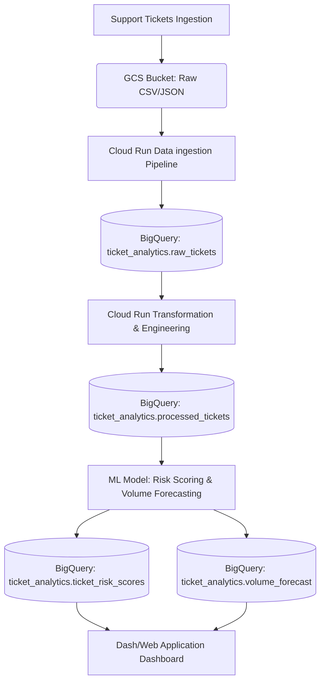

# Ticket Triage Dashboard

A Google Cloud-native automated ticket triage and analytics dashboard.

## Project Summary

### Problem Statement
Customer support operations often struggle with manual ticket sorting, prioritization, and resource allocation. This leads to slow response times, missed Service Level Agreements (SLAs), and inefficient staffing.

This project addresses these challenges by building an end-to-end data pipeline and dashboard that:
1. Automatically ingests support ticket data.
2. Performs feature engineering on incoming tickets.
3. Automatically computes risk scores and risk bands (triage) to flag critical issues early.
4. Forecasts daily/weekly ticket volumes per team to assist in staffing decisions.

---

## Architecture & Data Pipeline

The data pipeline consists of the following components on **Google Cloud Platform (GCP)**:

### 1. Ingestion Layer
*   **Google Cloud Storage**: Raw ticket exports are uploaded to a secure bucket:
    *   **Bucket Name**: `gs://ticket-triage-dashboard-ticket-data`

### 2. Warehousing & Feature Engineering (BigQuery)
All ticket analytics data is stored in the **`ticket_analytics`** dataset with these structured tables:
*   **`raw_tickets`**: Stores the raw incoming support ticket data.
*   **`processed_tickets`**: Contains raw ticket fields plus engineered features (e.g. SLA breach status, timing metrics, backlogs).
*   **`ticket_risk_scores`**: Stores computed ML-driven risk scores and bands (`HIGH`, `MEDIUM`, `LOW`) for automated triage.
*   **`volume_forecast`**: Stores predicted future ticket volumes per support team.

### 3. CI/CD & Artifact Management
*   **Artifact Registry**: Docker images for pipelines and dashboards are managed securely.

---

## Tech Stack
*   **Cloud Platform**: Google Cloud Platform (GCP)
    *   Cloud Storage (GCS)
    *   BigQuery
    *   Cloud Run
    *   Compute Engine
    *   Artifact Registry
    *   IAM
*   **Language**: Python (pandas, scikit-learn, etc.)
*   **CI/CD**: GitHub Actions
*   **Version Control**: GitHub

---

## GCP Deployment Configurations

*   **Google Cloud Project ID**: `ticket-triage-dashboard`
*   **BigQuery Dataset**: `ticket_analytics`
*   **Storage Bucket**: `ticket-triage-dashboard-ticket-data`
